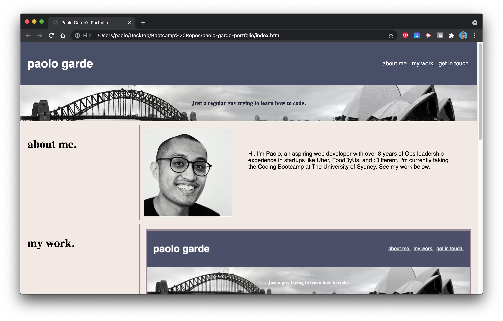

# Welcome to my portfolio 👋

I put together my portfolio using my current knowledge of HTML and CSS. Here you'll see a bit about me, my work, and ways to contact me.

I used flexboxes and media queries to achieve a responsive design which adapts to both mobile and desktop viewports. 

You can access via [this link](https://rpgarde.github.io/paolo-garde-portfolio/)

## This is how I've addressed the Acceptance Criteria

* GIVEN I need to sample a potential employee's previous work
* WHEN I load their portfolio
* THEN I am presented with the developer's name, a recent photo or avatar, and links to sections about them, their work, and how to contact them

    * Done, this portfolio has my name, photo, and sections on 1. About me 2. My portfolio 3. My contact details

* WHEN I click one of the links in the navigation
* THEN the UI scrolls to the corresponding section
    * I did this by naming each section with a unique "ID" then using the nav bar to link to those IDs.  

* WHEN I click on the link to the section about their work
* THEN the UI scrolls to a section with titled images of the developer's applications
    * Done, the "my work" section takes you the titled images. I achieved the title images by using relative/absolute position properties. 

* WHEN I am presented with the developer's first application 
* THEN that application's image should be larger in size than the others
    * Done, the first image is larger than the others, I did this by naming this image block a separate class and making its width 100% 

* WHEN I click on the images of the applications
* THEN I am taken to that deployed application
    * Done, I have examples here of my work which links to deployed applications on Github

* WHEN I resize the page or view the site on various screens and devices
* THEN I am presented with a responsive layout that adapts to my viewport
    * Done, when you fall below 768px, the 3-column layout (section label + 2 images) turns into a 1-column layout