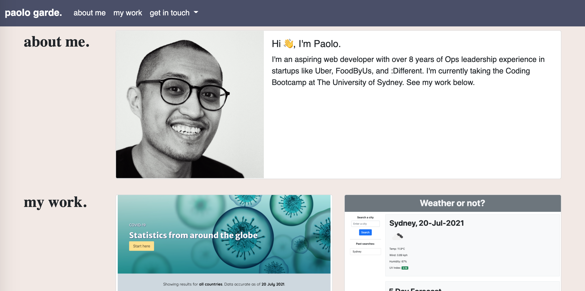
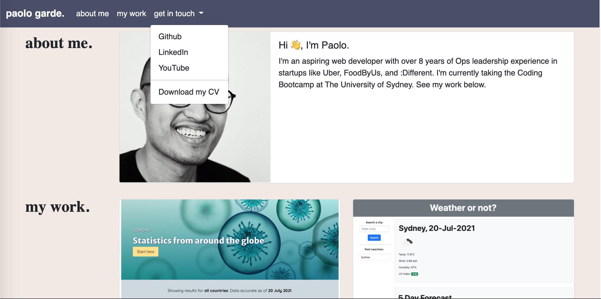

# Welcome to my portfolio 👋

This is the second version of my portfolio, using Bootstrap. This is a mobile-first design leveraging Bootstrap's responsive utilities.

On the navbar you can access the different sections. on the get in touch section, it has a dropdown where you can view links to my different online profiles, as well as a link to donwload my CV.

You can access via [this link](https://rpgarde.github.io/paolo-garde-portfolio/)

## Screenshot of the portfolio

## Dropdown functionality
